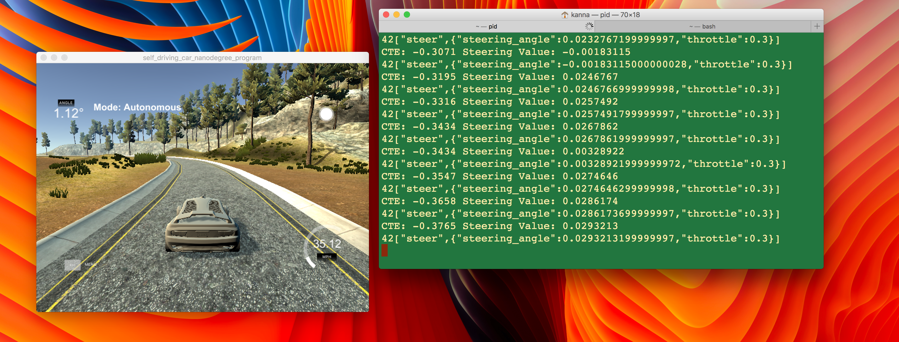

# CarND-Controls-PID
Self-Driving Car Engineer Nanodegree Program

---

## Dependencies

* cmake >= 3.5
 * All OSes: [click here for installation instructions](https://cmake.org/install/)
* make >= 4.1
  * Linux: make is installed by default on most Linux distros
  * Mac: [install Xcode command line tools to get make](https://developer.apple.com/xcode/features/)
  * Windows: [Click here for installation instructions](http://gnuwin32.sourceforge.net/packages/make.htm)
* gcc/g++ >= 5.4
  * Linux: gcc / g++ is installed by default on most Linux distros
  * Mac: same deal as make - [install Xcode command line tools]((https://developer.apple.com/xcode/features/)
  * Windows: recommend using [MinGW](http://www.mingw.org/)
* [uWebSockets](https://github.com/uWebSockets/uWebSockets)
  * Run either `./install-mac.sh` or `./install-ubuntu.sh`.
  * If you install from source, checkout to commit `e94b6e1`, i.e.
    ```
    git clone https://github.com/uWebSockets/uWebSockets
    cd uWebSockets
    git checkout e94b6e1
    ```
    Some function signatures have changed in v0.14.x. See [this PR](https://github.com/udacity/CarND-MPC-Project/pull/3) for more details.
* Simulator. You can download these from the [project intro page](https://github.com/udacity/self-driving-car-sim/releases) in the classroom.

## Basic Build Instructions

1. Clone this repo.
2. Make a build directory: `mkdir build && cd build`
3. Compile: `cmake .. && make`
4. Run it: `./pid`.


## Implementation

The PID Controller is implemented using the three variables P, I and D.
* P = Proportional(P) value corresponding to the CrossTrackError which is the distance of the car from the reference trajectory. This is used to steer the car to the right trajectory
* I = cumulative total of the errors seen so far
* D = Correcting P so as to smoothen and reduce the overshooting/oscillating nature of P

The formula for updating the error correction is below
d_error = cte - p_error  
p_error = cte  
i_error = cte + i_error  

The total error is calculated using the weighted sum using Kp, Ki and Kd coefficients
-Kp * p_error - Ki * i_error - Kd * d_error;


## Reflection

### Effect of P, I, D controllers

* The P controller adjusts the steering based on how far the car is from the reference trajectory. A large P gain made the car overshoot and oscillate out of the track. It pushed the steering value to the max and in the next step tried to correct it but instead of making the necessary correction, it overshot in the opposite direction. And the cycle continued.

* The D controller helped in balancing the heavy oscillation of the P gain. It used the rate of change of the P gain to control the car from oscillating too much.

* The I controller ensured that the car stayed closer to the track. A very small value of I was enough for this specific track.

### Choosing Hyperparameters

* The Hyperparameters were hand tuned by performing several experiments. Details in below table.

<table>
<tr><th>PID Values</th><th>Observations</th></tr>
<tr><td>pid.Init(0.0, 0.0, 0.0);</td><td>travels in a straight line and moves out of the track</td></tr>
<tr><td>pid.Init(10.0, 0.0, 0.0);</td><td>extremely volatile steering angle oscillations because of high P value - stops as soon as it nears the curve</td></tr>
<tr><td>pid.Init(10.0, 0.0, 50.0);</td><td>moves to a decent distance because of D's opposition to P - but gets out of track & stops</td></tr>
<tr><td>pid.Init(10.0, 5.0, 3.0);</td><td>keeps circling around as soon as it starts</td></tr>
<tr><td>pid.Init(0.5, 0.001, 2.2);</td><td>Works kind of ok but starts oscillating near the curve & stops in deep curves</td></tr>
<tr><td>pid.Init(0.2, 0.001, 2.0);</td><td>Completes a lap but zigzags till the end and then fails in the next lap</td></tr>
<tr><td>pid.Init(0.1, 0.0001, 2.0);</td><td>near perfect. completes several laps. touches the red lines occassionally</td></tr>
<tr><td>pid.Init(0.13, 0.0003, 2.0);</td><td>Final choice. slightly oscillating but does the job</td></tr>
</table>


## Simulation

